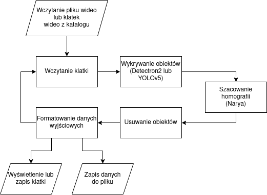
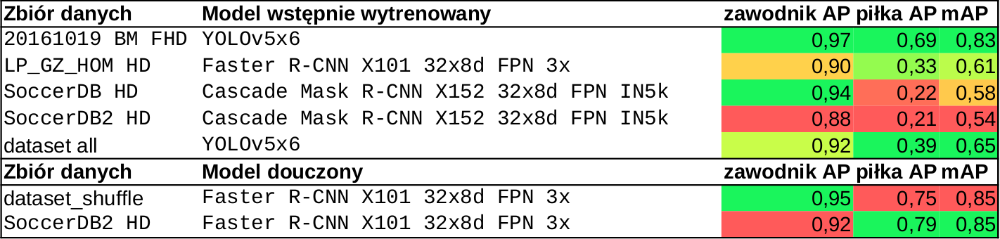
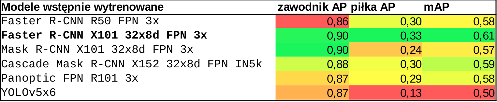
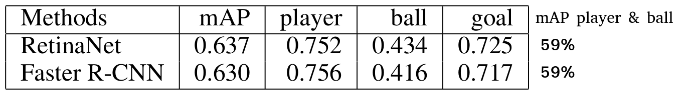
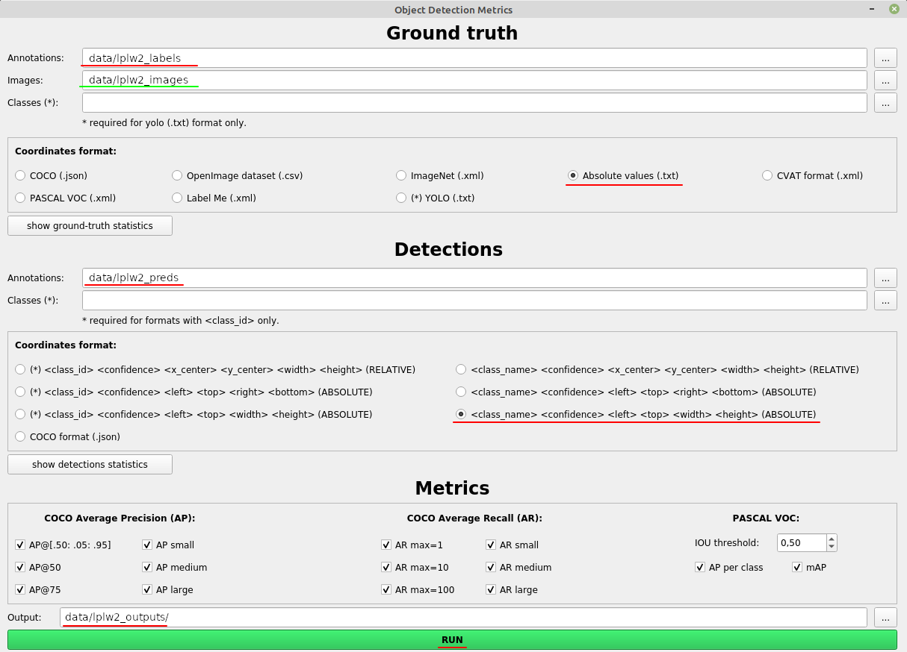

# ODATT - Object Detection Algorithms Test Tool
Narzędzie pozwalające przetestować dokładność szacowania zawodników oraz piłki na nagraniu lub zdjęciu z meczu piłki nożnej przez różnego rodzaju algorytmy detekcji obiektów wykorzystywane w widzeniu komputerowym.

## Przepływ danych w narzędziu ODATT
<p align="center">
     
</p>

## Zastosowane platformy
### Rozpoznawanie obiektów (zawodników i piłki):
* Detectron2 - https://github.com/facebookresearch/detectron2
* YOLOv5 - https://github.com/ultralytics/yolov5

### Homografia:
* Narya - https://github.com/DonsetPG/narya

## Modele pretrenowane:
[Faster R-CNN R50 FPN 3x](https://dl.fbaipublicfiles.com/detectron2/COCO-Detection/faster_rcnn_R_50_FPN_1x/137257794/model_final_b275ba.pkl) - [Konfiguracja](https://github.com/facebookresearch/detectron2/blob/main/configs/COCO-Detection/faster_rcnn_R_50_FPN_1x.yaml)   
[Faster R-CNN X101 32x8d FPN 3x](https://dl.fbaipublicfiles.com/detectron2/COCO-Detection/faster_rcnn_X_101_32x8d_FPN_3x/139173657/model_final_68b088.pkl) - [Konfiguracja](https://github.com/facebookresearch/detectron2/blob/main/configs/COCO-Detection/faster_rcnn_X_101_32x8d_FPN_3x.yaml)   
[Mask R-CMM X101 32x8d FPN 3x](https://dl.fbaipublicfiles.com/detectron2/COCO-InstanceSegmentation/mask_rcnn_X_101_32x8d_FPN_3x/139653917/model_final_2d9806.pkl) - [Konfiguracja](https://github.com/facebookresearch/detectron2/blob/main/configs/COCO-InstanceSegmentation/mask_rcnn_X_101_32x8d_FPN_3x.yaml)   
[Panoptic FPN R101 3x](https://dl.fbaipublicfiles.com/detectron2/COCO-PanopticSegmentation/panoptic_fpn_R_101_3x/139514519/model_final_cafdb1.pkl) - [Konfiguracja](https://github.com/facebookresearch/detectron2/blob/main/configs/COCO-PanopticSegmentation/panoptic_fpn_R_101_3x.yaml)   
[Cascade Mask R-CNN X152 32x8d FPN IN5k](https://dl.fbaipublicfiles.com/detectron2/COCO-PanopticSegmentation/panoptic_fpn_R_101_3x/139514519/model_final_cafdb1.pkl) - [Konfiguracja](https://github.com/facebookresearch/detectron2/blob/main/configs/Misc/cascade_mask_rcnn_X_152_32x8d_FPN_IN5k_gn_dconv.yaml)      
[YOLOv5x6](https://github.com/ultralytics/yolov5/releases/download/v6.2/yolov5x6.pt)

## Modele douczone:
[Faster R-CNN R50 FPN 3x](https://drive.google.com/file/d/1WYy7Jj4UHWbAZY6Io-Lx3ikb96mNVObI/view?usp=sharing) (wielkosć zbioru: 467 współczynnik uczenia: 0.0125 batch: 8 epoki: ~26) - [Konfiguracja](https://drive.google.com/file/d/1UHorcvav8zyWERpTpP17q9fUgRRasQ-m/view?usp=sharing)   
[Faster R-CNN X101 32x8d FPN 3x](https://drive.google.com/file/d/1Qgm-uIOseuXOcMmxg6tC6br_lybxDmzx/view?usp=sharing) (wielkosć zbioru: 467 współczynnik uczenia: 0.0125 batch: 3 epoki: ~9) - [Konfiguracja](https://drive.google.com/file/d/1OFp_ZmMmiTfrwdSTZoP1Y632zR-l_asI/view?usp=sharing)   
[Cascade Mask R-CNN X152 32x8d FPN IN5k](https://drive.google.com/file/d/1GhblU9BTEfLClSt4I4Qx_S7sLk7ZmKOG/view?usp=sharing) (wielkosć zbioru: 467 współczynnik uczenia: 0.0125 batch: 1 epoki: ~4) - [Konfiguracja](https://drive.google.com/file/d/1n6Xf0DWRCHndqLfl6Tk7iwXy7o9WRYgA/view?usp=sharing)   
[YOLOv5x6](https://drive.google.com/file/d/1GKabsvU7yEwJqyTa1uZs3AIvLZKXMRle/view?usp=sharing) (wielkosć zbioru: 467 współczynnik uczenia: 0.01 batch: 6 epoki: 100)

W przypadku uczenia modeli dostarczonych przez platformę Detectron2 użyty został skrypt [train_detectron2.py](train_detectron2.py)  
W przypadku uczenia modelu YOLOv5x6 użyty został skrypt dostarczony przez platformę YOLOv5 [train.py](https://github.com/ultralytics/yolov5/blob/master/train.py). Skrypt uruchomiony został z parametrami:   
```bash
python train.py --img 1280 --epochs 100 --batch 6 --data yolo_dataset.yaml --weights yolov5x.pt --cache --freeze 9
```

### Rozpoznawanie obiektów (zawodników i piłki):
* Detectron2 - https://github.com/facebookresearch/detectron2/blob/main/MODEL_ZOO.md   
* YOLOv5 - https://github.com/ultralytics/yolov5/releases

### Homografia:
* Narya - https://github.com/DonsetPG/narya#links-to-the-models-and-datasets-from-the-original-paper

## Instalacja środowiska
```bash
conda create --name ODATT python==3.7
conda activate ODATT
conda install pip -y
conda install -c pytorch -c conda-forge cudatoolkit=11.1 cudnn tqdm -y
pip install torch==1.10.1+cu111 torchvision==0.11.2+cu111 torchaudio==0.10.1 -f https://download.pytorch.org/whl/torch_stable.html
pip install opencv-python
conda install gcc_linux-64 gxx_linux-64 -y
ln -s ~/miniconda3/envs/ODATT/bin/x86_64-conda-linux-gnu-gcc ~/miniconda3/envs/ODATT/bin/gcc
ln -s ~/miniconda3/envs/ODATT/bin/x86_64-conda-linux-gnu-g++ ~/miniconda3/envs/ODATT/bin/g++
cp ~/miniconda3/envs/ODATT/lib/python3.7/_sysconfigdata_x86_64_conda_cos6_linux_gnu.py ~/miniconda3/envs/ODATT/lib/python3.7/_sysconfigdata_x86_64_conda_linux_gnu.py
python -m pip install detectron2==0.6 -f https://dl.fbaipublicfiles.com/detectron2/wheels/cu111/torch1.10/index.html
pip install tensorflow==2.8.0 segmentation-models gluoncv Shapely moviepy kornia seaborn split-folders
conda env config vars set LD_LIBRARY_PATH=~/miniconda3/envs/ODATT/lib
conda deactivate
conda activate ODATT
```

## Dataset

### Przykładowy oznaczony zbiór danych
[LP_GZ_HOM](https://drive.google.com/file/d/1u-DYGnR_p4xWOnplDEZnyoA9VwWzd_88/view?usp=sharing)

### SoccerNet
```bash
pip install SoccerNet --upgrade
import SoccerNet
from SoccerNet.Downloader import SoccerNetDownloader
mySoccerNetDownloader=SoccerNetDownloader(LocalDirectory="path/to/SoccerNet") 
```

### Przygotowanie materiału
```
# Dla redukcji pasków na filmie
# Urządzenie dekodujące i kodujące NVIDIA
ffmpeg -hwaccel nvdec -i "1_HQ.mkv" -c:v h264_nvdec -vf yadif=1 -refs 2 -r 25 -vcodec h264_nvenc -b:v 8000k "1_HQ_p.mkv"
# Urządzenie dekodujące i kodujące CPU
ffmpeg -i "1_HQ.mkv" -c:v libx264 -vf yadif=1 -refs 2 -r 25 -vcodec libx264 -b:v 8000k "1_HQ_p.mkv"
```

### Porównanie zbiorów danych:

| Zbiór                                            | Rozdzielczość  | Oznaczone klatki             | Homografia   | Uwagi                                                                                                                 |
|--------------------------------------------------|----------------|------------------------------|--------------|-----------------------------------------------------------------------------------------------------------------------|
| [SoccerDB](https://github.com/newsdata/SoccerDB) | FullHD 25kl/s  | co 3 klatki (45 000 klatek¹) | Brak         | Pozycja klatki zapisana jest za pomocą czasu i numeru klatki więc jest to zapis nie dokładny.²                        |
| [SoccerNET](https://www.soccer-net.org/)         | FullHD 25kl/s  | co 12 klatek (5400 klatek³)  | co 12 klatek | Pozycja klatki oraz homografii zapisana jako klatka po klatce dla nagrania 2kl/s. Homografia nie jest super dokładna. |
| Wyscout                                          | FullHD 25kl/s  | Brak                         | Brak         |                                                                                                                       |

1 - 90*60*(25//3)/2 = 45000   
2 - Klatki zapisane są w bazie lmdb. Pozycja klatki w danym segmencie (akcji/event'cie) zapisana jest jako numer klatki w tej akcji. Pozycja eventu zapisana jest w pliku seg_info.csv i pozycja opisana jest za pomocą czasu a nie za pomocą numeru klatki w oryginalnym nagraniu wideo. Aby obliczyć numer badanej klatki względem oryginalnego wideo należy obliczyć numer klatki dla start_time następnie dodać do tej klatki offset badanej klatki z bazy lmdb. Obliczanie numeru klatki z czasu jest niedokładne i może wprowadzać błąd pozycjonowania badanej klatki. Implementacja narzędzia do wczytywania danych z bazy lmdb: [lmdb_read.py](tools/lmdb_read.py).    
3 - Adnotacje w SoccerNET oznaczane są na nagraniach przekonwertowanych do 2 klatek/s. 90*60*(25//12)/2 = 5400 klatek. Adotacje homografii nie są idealne i czasami są rozbieżne z prawdziwymi liniami na boisku. Narzędzie do wczytywania danych z SoccerNET: [soccer_net.py](tools/soccer_net.py).   
Dane z dnia 16.12.2021r.

### Zbiory wykorzystywane do badań
* "20161019 BM HD" - Zbiór danych zawierający 240 klatek wideo w rozdzielczości HD (1280 px na 720 px) pochodzący ze zbioru SoccerNet. W pierwszym etapie, materiał wideo został przekonwertowany za pomocą programu FFmpeg w celu ustawienia prawidłowej synchronizacji klatek i usunięcia poziomych linii mogących mieć wpływ na dokładność wykrywania obiektów. Zachowana została oryginalna rozdzielczość (1920x1080 px) oraz przepływność materiału wideo. Następnie wyodrębnione zostały klatki wideo zgodnie z dostępnymi oznaczeniami danych czyli co 13. klatkę wideo. Zbiór został zweryfikowany i usunięte zostały klatki o słabej jakości oznaczeń następnie klatki zbioru zostały przseskalowane do rozdzielczości 1280x720 px.    
* "LP_GZ_HOM HD" - Zbiór zawiera ujęcia (136 klatek) z kamery taktycznej z jednego z meczów klubu sportowego KKS Lech Poznań, została wybrana co 1000. klatka wideo. Na każdej klatce zostały wstępnie wykryte obiekty za pomocą narzędzia badawczego a następnie ręcznie zweryfikowane i skorygowane przy użyciu narzędzia DarkLabel. Za pomocą specjalnie stworzonego skryptu "[convert_labels.py](tools/convert_labels.py)", dane zostały przekształcone do formatu zgodnego z narzędziem do analizy i badania metryk. Materiał wideo został dostarczony przez klub sportowy KKS Lech Poznań.
* "SoccerDB HD" - Zbiór zawiera 208 klatek z jednego meczu ze zbioru SoccerDB. Klatki wideo zostały wyodrębnione z pierwszej połowy meczu w różnych odstępach czasowych. Dodatkowo zbiór został ręcznie zweryfikowany pod kątem dokładności oznaczeń. Oznaczenia niskiej dokładności zostały usunięte.
* "SoccerDB2 HD" - Zbiór zawiera 1057 klatek z trzech meczów ze zbioru SoccerDB i nie zawiera klatek ze zbioru "SpccerDB HD". Zbiór nie został zweryfikowany pod kątem jakości oznaczeń i został wykorzystany do zbadania dokładności modeli douczonych.
* "dataset_all" - Połączone zbiory  "20161019 BM HD", "LP_GZ_HOM HD", "SoccerDB HD"
* "dataset_shuffle" - Zbiór użyty do uczenia modeli. Wykorzystane zostały zbiory "20161019 BM HD", "LP_GZ_HOM HD", "SoccerDB HD" z których powstał przetasowany zbiór "dataset_shuffle" zawierający 467 klatek dla zbioru trenującego i 117 dla zbioru testującego.

## Uruchamianie
### Konfiguracja narzędzia [ODATT](ODATT.py)
#### Konfiguracja wczytywania modeli (w sekcji `if __name__ == "__main__"`):
Dla platformy Detectron2  w przypadku podania ścieżki do konfiguracji modelu, model zostanie pobrany automatycznie np (plik [ODATT.py](ODATT.py)):
```
object_detection_model_path = "COCO-InstanceSegmentation/mask_rcnn_X_101_32x8d_FPN_3x.yaml"
object_detection_config_path = "COCO-InstanceSegmentation/mask_rcnn_X_101_32x8d_FPN_3x.yaml"
```
Dla platformy YOLOv5 w przypadku podania nazwy modelu, model zostanie pobrany automatycznie np (plik [ODATT.py](ODATT.py)):
```
object_detection_model_path = "yolov5x6"
object_detection_config_path = None
```
Wczytywanie modelu douczonego z pliku, dla platformy Detectron2 (plik [ODATT.py](ODATT.py)):
```
object_detection_model_path = "models/model_final_faster_rcnn_R_50_FPN_3x.pth"
object_detection_config_path = "models/model_final_faster_rcnn_R_50_FPN_3x.yml"
```
Wczytywanie modelu douczonego z pliku, dla platformy YOLOv5 (plik [ODATT.py](ODATT.py)):
```
object_detection_model_path = "models/yolov5x6.pt"
object_detection_config_path = None
```

#### Konfiguracja nazwy klasy obiektu w pliku wynikowym
Dla wyników zawierających nazwę klasy wykrytego obiektu (linia [18](ODATT.py#L18) i [19](ODATT.py#L19) pliku [ODATT.py](ODATT.py)):
```
PERSON_OBJECT_CLASS_OUTPUT_LABEL = "player"
BALL_OBJECT_CLASS_OUTPUT_LABEL = "ball"
```
Dla wyników zawierających identyfikator klasy wykrytego obiektu (linia [18](ODATT.py#L18) i [19](ODATT.py#L19) pliku [ODATT.py](ODATT.py)):
```
PERSON_OBJECT_CLASS_OUTPUT_LABEL = 0
BALL_OBJECT_CLASS_OUTPUT_LABEL = 1
```

#### Konfiguracja wykrywanych klas obiektów
Dla modeli wstępnie wytrenowanych (linia [56](ODATT.py#L56) i [57](ODATT.py#L57) w klasie ODATT, w pliku [ODATT.py](ODATT.py)):
```
    PERSON_OBJECT_CLASS = 0
    BALL_OBJECT_CLASS = 32
```
Dla modeli doucznoych (na dwóch klasach) ("people" oraz "ball") (linia [56](ODATT.py#L56) i [57](ODATT.py#L57) w klasie ODATT, w pliku [ODATT.py](ODATT.py)):
```
    PERSON_OBJECT_CLASS = 0
    BALL_OBJECT_CLASS = 1
```

#### Konfiguracja wykorzystywanej platformy (w sekcji `if __name__ == "__main__"`) (linia [479](ODATT.py#L479) i [486](ODATT.py#L486)):
Dla platfromy Detectron2 `detector_type=ODATT.DetectorType.DETECTRON` :
```
    if args.input:
        tv2d = ODATT(object_detection_model_path, object_detection_config_path=object_detection_config_path,
                     ..., detector_type=ODATT.DetectorType.DETECTRON)
    elif args.video_input:
        tv2d = ODATT(object_detection_model_path, object_detection_config_path=object_detection_config_path,
                     ..., detector_type=ODATT.DetectorType.DETECTRON)
```
Dla platformy YOLOv5 `detector_type=ODATT.DetectorType.YOLOv5`:
```
    if args.input:
        tv2d = ODATT(object_detection_model_path, object_detection_config_path=object_detection_config_path,
                     ..., detector_type=ODATT.DetectorType.YOLOv5)
    elif args.video_input:
        tv2d = ODATT(object_detection_model_path, object_detection_config_path=object_detection_config_path,
                     ..., detector_type=ODATT.DetectorType.YOLOv5)
```

### Uruchamianie narzędzia ODATT
```
# Plik wejściowy typu wideo, eksportowanie klatek z oznaczonymi zawodnikiami oraz piłką, eksportowanie danych wyjściowych (oznaczeń wykrytych obiektów do katalogu - każda klataka = osobny plik)
python ODATT.py --video-input "data/LP_GZ_10s_KT.mp4" --export-frames-path "data/LP_GZ_10s_KT/images" --export-data-path "data/LP_GZ_10s_KT/outputs"
# Plik wejściowy typu wideo, eksportowanie danych wyjściowych (oznaczeń wykrytych obiektów do pliku - każda klataka = nowa linia)
python ODATT.py --video-input "data/LP_GZ_10s_KT.mp4" --export-data-path "data/LP_GZ_10s_KT/outputs.txt"
# Katalog wejściowy zawierający wyekstrahowne klatki, eksportowanie danych wyjściowych (oznaczeń wykrytych obiektów do katalogu - każda klataka = osobny plik)
python ODATT.py --input "data/LP_GZ_10s_KT/images" --export-data-path "data/LP_GZ_10s_KT/outputs"
```

### Przydatne skrypty
Dokładny opis użycia skryptów znajduje się w pliku danego skrytpu.   
[clear_directory.py](tools/clear_directory.py) - Narzędzie do usuwania plików na podstawie innego katalogu zawierającego te same pliki (mogą być inne rozszerzenia)   
[convert_labels.py](tools/convert_labels.py) - Narzędzie do konwetrownia plików z oznaczeniami z różnych formatów (np. YOLO, COCO ...) do innego formatu z opcją skalowania   
[copy_all_results_directory.py](tools/copy_all_results_directory.py) - Narzędzie do rekurencyjnego kopiowania struktury katalogów wraz z plikami wynikowymi
[create_JSON_COCO_file.py](tools/create_JSON_COCO_file.py) - Narzędzie do tworzenia pliku COCO zgodnego z formatem Detectron2 na podstawie plików oznaczeń z katalogu   
[extract_frames_by_dir.py](tools/extract_frames_by_dir.py) - Narzędzie do wyodrębniania klatek z wideo na podstawie zawartości katalogu z plikami wyodrębnionymi przez soccer_net.py   
[resize_images.py](tools/resize_images.py) - Skrypt do zmiany rozmiaru wszystkich obrazów w ścieżce źródłowej z eksportem do ścieżki docelowej   
[shuffle_dataset.py](tools/shuffle_dataset.py) - Narzędzie do dzielenia i tosowania zbioru na dane trenujące oraz testujące   
[soccer_net_downloader.py](tools/soccer_net_downloader.py) - Narzędzie do pobierania danych przy użyciu API SoccerNET (wymagane dane logowania)   
[soccer_net.py](tools/soccer_net.py) - Skrypt do generowania obrazów z adnotacjami z nagrania meczu z datasetu SoccerNet


## Przykładowe dane wyjściowe
### Format danych wyjściowych:
```
object_class score bb_x bb_y bb_width bb_height
```
Należy pamiętać, że położenie i rozmiary obwiedni (bounding box) _bb_x, bb_y, bb_width, bb_height_ są zależne od rozmiaru przetwarzanego wideo i nie są w żaden sposób normalizowane.
* object_class - id lub nazwa klasy wykrywanego obiektu (0 lub "player", 1 lub "ball")
* bb_x - x dla lewego górnego rogu bounding boxa
* bb_y - y dla lewego górnego rogu bounding boxa
* bb_width - szerokość bounding boxa
* bb_height - wysokość bounding boxa
* score - Wynik dokładoności oszacowania, że dany obiekt należy to danej klasy (człowiek, piłka), czyli jakie jest prawdopodobieństwo, że jest to człowiek lub piłka.
### Przykładowy plik wynikowy csv:
```
player 1.0 267 735 90 96
player 1.0 945 273 30 76
player 1.0 282 671 36 105
player 1.0 1617 551 36 99
ball 0.99 1609 443 13 14
player 0.99 1758 384 33 85
...
```

## Rezultaty:

### Dokładność wykrywania obiektów danej architektury:

#### Tabela wyników najlepszych architektur dla danego zbioru danych:
<p align="center">
     
</p>

#### Tabela wyników dokładności rozpoznawania typu obiektu dla zbioru "LP_GZ_HOM HD":
<p align="center">
     
</p>

Zbór danych "SoccerDB" oraz "20161019 BM FHD" zawiera klatki z różnych ujęć kamery. Natomiast zbiór "LP_GZ_HOM" zawierał materiał wideo nagrywany ze stałego ujęcia. Ma to wpływ na wyniki, ponieważ w zbiorze "SoccerDB" oraz "20161019 BM FHD" ującia były w bliższej perspektywie do zawodników i piłki.
### Wyniki uzyskane przez SoccerDB:
<p align="center">
     
</p>

## Narzędzie do ewaluacji modeli rozpoznawania zawodników i piłki:
https://github.com/rafaelpadilla/review_object_detection_metrics   
<p align="center">
     
</p>

### Tworzenie środowiska do uruchomienia narzędzia do ewaluacji:
```bash
git clone https://github.com/rafaelpadilla/review_object_detection_metrics
conda env create -n RODM --file environment.yml
conda activate RODM
python setup.py install
python run.py
```

## Narzędzie oznaczania danych do rozpoznawania, śledzenia piłki oraz zawodników i przypisywania zawodników do drużyny:
[DarkLabel](https://github.com/darkpgmr/DarkLabel)

## Generowanie danych za pomocą symulatora _Google Research Football_
https://github.com/google-research/football

## Co można poprawić/dodać/zmienić:
* Detekcja zawodników i piłki:
  * Przyciąć obraz wideo do obszaru boiska (wyciąć trybuny itp.)
  * Podzielić obraz na cztery równe regiony gdzie każdy z nich będzie przetwarzany osobno
  * Dotrenować pretrenowane modele na większym zbiorze danych
  * Przetestować douczeanie modeli przy użyciu danych wygenerowanych przez symulator _Google Research Football_
  * Poprawić jakość materiału wideo za pomocą preprocessingu
    * Video Super Resolution
    * [BM3D](https://github.com/glemaitre/BM3D)
  * Do piłki zastosować model wykrywający małe obiekty
  * Badanie obiektów szybko przemieszczających się
  * Zmienić konfigurację parametrów wykorzytywanych architektur oraz parametórw uczenia modeli ("threshold", "learning rate", "epoch" itp.)
* Homografia
  * Dodać filtr Kalmana
  * Zbadać filtr Savitzky-Golay (Savgol filter) (https://pubs.acs.org/doi/10.1021/acsmeasuresciau.1c00054)
  * Dotrenować pretrenowane sieci, szczególnie dla ujęć środkowego pola boiska
  * Zmienić konfigurację parametrów ("threshold" itp.)

## Bibliografia
* Ananth,S .Fast r-cnn for object detection https://towardsdatascience.com/fast-r-cnn-for-object-detection-a-technical-summary-a0ff94faa022,2019.      
* Bochkovskiy, A., Wang, C., and Liao, H. M. Yolov4: Optimalspeed and accuracy of object detection. CoRR abs/2004.10934 (2020).   
* Chollet, F. Deep learning with Python. Manning, 2018.   
* Dana H. Ballard, C. M. B. Computer Vision. Prentice-Hall, Inc,1982.   
* Deliège, A., Cioppa, A., Giancola, S., Seikavandi, M. J., Dueholm, J. V., Nasrollahi, K., Ghanem, B., Moeslund, T. B., and Droogenbroeck, M. V. Soccernet-v2 : A dataset and benchmarks for holistic understanding of broadcast soccer videos. In The IEEE Conference on Computer Vision and Pattern Recognition (CVPR) Workshops (June 2021).
* Deng, Z., Sun, H., Zhou, S., Zhao, J., Lei, L., and Zou, H.Multi-scale object detection in remote sensing imagery with convolutional neural networks. ISPRS Journal of Photogrammetry and RemoteSensing 145 (05 2018).   
* F. Luger, G. Artifical inteligence: Structures and Strategiesfor Complex Problem Solving. Pearson, 2009.   
* Garnier, P., and Gregoir, T. Evaluating soccer player: from live camera to deep reinforcement learning. CoRR abs/2101.05388 (2021).   
* Guimaraes, D. A. Digital Transmission: A Simulation-Aided Introduction with VisSim/Comm. Springer Berlin, Heidelberg, 2009.   
* Han, S., Dong, X., Hao, X., and Miao, S.Extracting objects; spatial;temporal information based on surveillance videos and the digital surface model. ISPRS International Journal ofGeo-Information 11, 2 (2022).   
* Haykin, S. Neural Networks and Learning Machines Third Edition. Pearson, 2008.   
* He, K., Gkioxari, G., Dollár, P., and Girshick, R. B. Mask R-CNN. CoRR abs/1703.06870 (2017).   
* He, K., Zhang, X., Ren, S., and Sun, J. Deep residual learning forimage recognition. CoRR abs/1512.03385 (2015).   
* Jiang, Y., Cui, K., Chen, L., Wang, C., Wang, C., Liu, H., andXu, C. Comprehensive soccer video understanding: Towards humancomparable video understanding system in constrained environment.CoRR abs/1912.04465 (2019).   
* Khandelwal,R.How to solve randomness in an artificial neural network? https://towardsdatascience.com/how-to-solve-randomness-in-an-artificial-neural-network-3befc4f27d45,2020.   
* Kirillov, A. Panoptic segmentation: Task and approaches. https://www.dropbox.com/s/t6tg87t78pdq6v3/cvpr19_tutorial_alexander_kirillov.pdf?dl=0, 2019.   
* Kirillov, A., Girshick, R. B., He, K., and Dollár, P. Panopticfeature pyramid networks. CoRR abs/1901.02446 (2019).   
* Kirillov, A., He, K., Girshick, R. B., Rother, C., and Dollár,P. Panoptic segmentation. CoRR abs/1801.00868 (2018).   
* Kurach, K., Raichuk, A., Stanczyk, P., Zajac, M., Bachem,O., Espeholt, L., Riquelme, C., Vincent, D., Michalski, M.,Bousquet, O., and Gelly, S. Google research football: A novelreinforcement learning environment. CoRR abs/1907.11180 (2019).   
* Kwasigroch, A., and Grochowski, M. Rozpoznawanie obiektów przez głębokie sieci neuronowe. Zeszyty Naukowe Wydziału Elektro-techniki i Automatyki Politechniki Gdańskiej 60 (2018), 63–65.   
* Li, Y., Wang, H., Dang, L. M., Han, D., Moon, H., and Nguy-en, T. A deep learning-based hybrid framework for object detectionand recognition in autonomous driving. IEEE Access 8 (10 2020).   
* Lin, T.-Y., Dollár, P., Girshick, R., He, K., Hariharan, B.,and Belongie, S. Feature pyramid networks for object detection, 2016.   
* Majewski, M., and Pałka, D. System graficznego rozpoznawania obiektów ruchomych. Zeszyty Naukowe WWSI 13, 21 (2019), 57–73.   
* Manning, C. Artificial Intelligence Definitions. Stanford University, 2020.   
* Padilla, R., Netto, S. L., and da Silva, E. A. B. A survey onperformance metrics for object-detection algorithms. In 2020 International Conference on Systems, Signals and Image Processing (IWSSIP)(2020), pp. 237–242.   
* Padilla, R., Passos, W. L., Dias, T. L. B., Netto, S. L., and DA Silva, E. A. B. A comparative analysis of object detection metrics with a companion open-source toolkit. Electronics 10, 3 (2021).   
* Ren, S., He, K., Girshick, R. B., and Sun, J. Faster R-CNN: towards real-time object detection with region proposal networks. CoRRabs/1506.01497 (2015).   
* Rosebrock, A. Intersection over union (iou) for object detection. https://pyimagesearch.com/2016/11/07/intersection-over-union-iou-for-object-detection/, 2016.   
* Szeliski, R. Computer Vision: Algorithms and Applications. Springer,2021.   
* Tadeusiewicz, R. Sieci neuronowe. Akademicka Oficyna Wydawnicza,1993.   
* Tan, M., and Le, Q. V. Efficientnet: Rethinking model scaling forconvolutional neural networks. CoRR abs/1905.11946 (2019).   
* Tan, M., Pang, R., and Le, Q. V. Efficientdet: Scalable and efficientobject detection. CoRR abs/1911.09070 (2019).   
* Uijlings, J., van de Sande, K., Gevers, T., and Smeulders,A. Selective search for object recognition. International Journal of Computer Vision (2013).BIBLIOGRAFIA82   
* Wu, Y., Kirillov, A., Massa, F., Lo, W.-Y., and Girshick, R. Detectron2. https://github.com/facebookresearch/detectron2, 2019.   
* WuZhe. Yolov5 (6.0/6.1) brief summary. https://github.com/ultralytics/yolov5/issues/6998#1, 2022.   
* Xie, S., Girshick, R. B., Dollár, P., Tu, Z., and He, K. Aggregated residual transformations for deep neural networks. CoRR ab-s/1611.05431 (2016).   
* Yang, Z., Dong, R., Xu, H., and Gu, J. Instance segmentationmethod based on improved mask r-cnn for the stacked electronic com-ponents. Electronics 9, 6 (2020).   
* You, K., Liu, Y., Wang, J., and Long, M. Logme: Practical assessment of pre-trained models for transfer learning. 12133–12143.

## Licencja

Narzędzie ODATT wydane zostało na licencji [Apache 2.0](LICENSE).

## Autor Narzędzia
inż. Jan Nowak   
email: 95jan.nowak@gmail.com   
Uniwersytet im. Adama Mickiewicza w Poznaniu   
Wydział Matematyki i Informatyki   
Promotor: prof. UAM dr hab. Krzysztof Dyczkowski   
Przy współpracy z klubem sportowym KKS Lech Poznań
<p align="center">
    
</p>

Narzedzie stworzone i wykorzystywane na potrzeby przeprowadzenia badań pracy magisterskiej.
